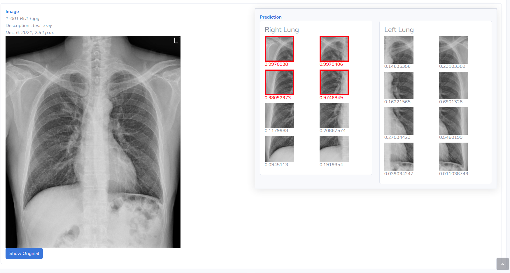

# Lung Cancer Website
NCKU IIR lab

## Purpose
We develop a lung cancer lung nodule detection model. So we develop a website to run the model

## How to install
[](https://www.python.org/downloads/release/python-360/)

docker install : to be continue

## How to run
1. rename `env_example` to `.env`
```
mv env_example .env
```
2. generate django secret key, and paste key into `.env`
```
python -c 'from django.core.management.utils import get_random_secret_key; print(get_random_secret_key())'
```
3. database
to use sqlite, simply
```
touch db.sqlite3
```
4. runserver
```
python manage.py runserver 0:[port]
```
5. in your web browser
```
127.0.0.1:[port]/run_model
```

## Screen shots
history page

result page


## Feature List
- [x] Run Model
- [x] Upload image (png, jpg, jpeg...)
- [x] Show patches results
- [x] Show History Cases
- [ ] Upload folder
- [ ] Swap model weights
- [ ] Adjust Chest Xray image brightness and contrast
- [ ] Login
- [ ] Dashboard
- [ ] Search in History Page
- [ ] If model inference failed, show message
